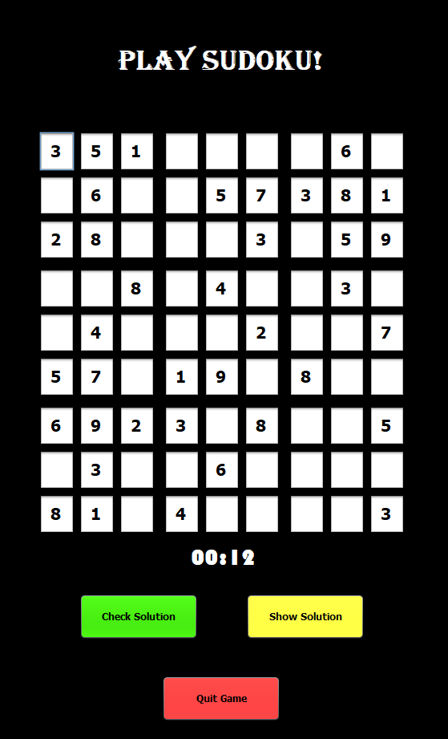

Portfolio
=========

Programming Projects
--------------------

*For access to my private project repositories, please [email me](mailto:mtweigel@csustudent.net?subject=GitHub%20Access) with the subject line, GitHub Access.

---
### [Sudoku Game | CSCI 325](projects/sudoku)

---
### [Project 2 Title | CSCI 315](project1)

---
### [Project 3 Title | CSCI 325](project1)

---
### [Project 4 Title | CSCI 332](project1)

---

Ethics Papers
-------------

### [Ethics or Profits?](/pdf/ethicsorprofits.pdf)

-   **Class:** CSCI 325
-   **Grade:** A

### [Intellectual Property or Public Domain?](/pdf/intellectualproperty.pdf)

-   **Class:** CSCI 332
-   **Grade:** B

### [How Much Testing is Enough?](/pdf/howmuchtesting.pdf)

-   **Class:** CSCI 315
-   **Grade:** A

---

Presentations
-------------

### [Colonial Pipeline Ransomeware Attack](/pdf/piplineattack.pdf)

- **Class:** CSCI 301
- **Grade:** A

### [Target Data Breach](/pdf/targetbreach.pdf)

- **Class:** CSCI 405
- **Grade:** A

---

Page template forked from <a href="https://github.com/csu-cs/csci-portfolio">CSU-CS</a>

<!-- Remove above link if you don't want to attributive -->
